# MultiCloudDevOpsProject
**Welcome to the MultiCloudDevOpsProject repository! This project is designed to demonstrate a full DevOps pipeline including infrastructure provisioning, configuration management, containerization, continuous integration, monitoring, and logging, primarily focused on a multi-cloud environment.**


## Overview
The MultiCloudDevOpsProject aims to establish a robust DevOps pipeline using modern tools and practices across multiple cloud environments. This project involves infrastructure provisioning with Terraform, configuration management with Ansible, containerization with Docker, continuous integration with Jenkins, and extensive monitoring and logging.


## Rebosatory structure

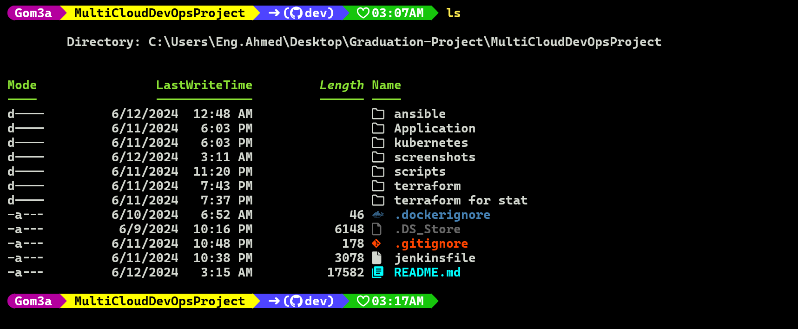

## Table of Contents
- Project Setup
- Infrastructure Provisioning
- Configuration Management
- Containerization
- Continuous Integration
- Automated Deployment Pipeline
- Monitoring and Logging
- AWS Integration
- Documentation

## Prerequisites
Before using this project, ensure that you have the following prerequisites:

- Docker: For building and managing containerized applications.
- Kubernetes/OpenShift: For orchestrating containerized applications.
- Jenkins: For implementing continuous integration and continuous deployment (CI/CD) pipelines.
- Docker Hub Account: For storing Docker images.
- Git: For version control and cloning the project repository.

## Repository Setup
### Initial Configuration
- Create and Clone the Repository:

A new repository named "MultiCloudDevOpsProject" was created.
Clone this repository to get started:
```bash
git clone https://github.com/gahmedg/MultiCloudDevOpsProject.git
```
- Branching:
    - Main branch: Contains the production-ready code.
    - Dev branch: All development work happens here. Default branch for ongoing changes.

#### Branch Creation:

Create a development branch named dev.
Instructions:
```bash
git checkout -b dev
git push origin dev
```

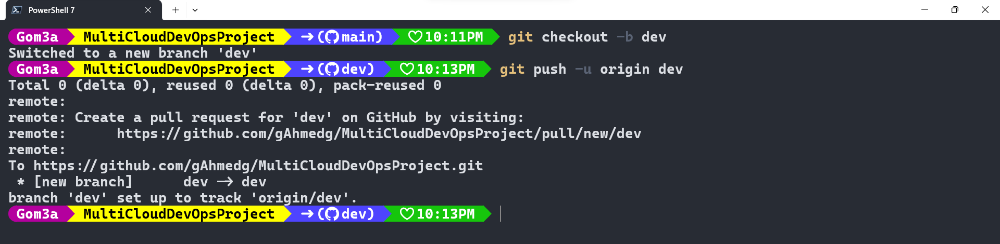

#### And this the output in github website 

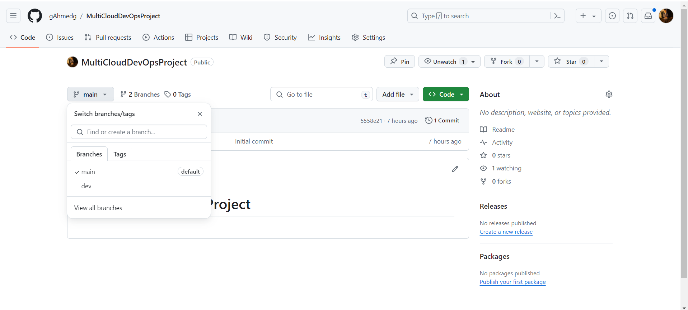

## Infrastructure Provisioning with Terraform
### Task: 
- Provision AWS resources including VPC, subnets, security groups, and EC2 instances.
### Steps:
- Write Terraform modules for each resource.
- Use the modules to create the infrastructure.
- Commit the Terraform scripts to the dev branch.
- save the state in remote backend state ( S3 with DynamoDB)

### Terraform Setup


the goal of this task is to provision AWS infrastructure using Terraform scripts. Specifically, the task involves provisioning the following resources:

- Virtual Private Cloud (VPC)
- Subnets
- Security Groups
- EC2 instances for deploying applications

### Deliverables:

1. **Terraform Scripts**: 
   - The Terraform scripts should be developed and committed to the repository provided.
   - These scripts will define the infrastructure as code, enabling reproducible and version-controlled infrastructure provisioning.

2. **Use of Terraform Modules**:
   - Modularization of Terraform code is encouraged to promote reusability, maintainability, and readability.
   - Utilize Terraform modules for managing different components of the infrastructure, such as VPC, Subnets, Security Groups, and EC2 instances.

```
project-root/
│
├── terraform/
│ ├── main.tf
│ ├── variables.tf
│ ├── outputs.tf
│ ├── modules/
│ │ ├── vpc/
│ │ │    ├── main.tf
│ │ │    ├── variables.tf
│ │ │    └── outputs.tf
│ │ └── instances/
│ │      ├── main.tf
│ │      ├── variables.tf
│ │      └── outputs.tf
│ └── terraform.tfvars
└── README.md
```

### Getting Started:
Before starting to provisioning infrastructure we need to create Backend state to store backend of infrastructure using s3 with DynamoDB
#### insure the aws account and iam user 


```bash
# chane dir to terraform for stat
   cd "terraform for stat"
```


```bash
   terraform init
```


```bash
   terraform apply -auto-approve
```


##### S3 and DynamoDB

[text](README.md)  


1. **Navigate to the Terraform Directory**:
```bash
   cd terraform
```
2. **Initialize Terraform**:
```bash
  terraform init
```
3. **Provide AWS Credentials**:

Ensure that AWS credentials are configured either through environment variables or AWS shared credentials file.

4. **Apply Infrastructure Changes**:

```bash
terraform apply -auto-approve
```


5. **verify-the-same-ip-from-console**


## EC2 Monitoring and Notification Setup using Terraform

## Configuration
Below are the configurations to be added to your Terraform files:


### Steps
### Step 1: Create an SNS Topic and Subscription
create an SNS topic named cpu-utilization-topic to handle notifications.
Ucreate a subscription to the SNS topic that will send notifications to your email address.
  

### Step 2: Create a CloudWatch Alarm
Ensure you have the ID of the EC2 instance you want to monitor. This instance ID will be used in the CloudWatch alarm configuration.
 CloudWatch alarm that monitors the CPUUtilization metric of your EC2 instance.
Configure the alarm to trigger when CPU utilization is greater than or equal to 70%

 


after we getting the ip from terraform we will pass it to Ansible inventory to run playbook on it 

## Configuration Management with Ansible

### Task Description:

The objective of this task is to configure EC2 instances using Ansible playbooks. The playbooks should automate the following tasks:

- Installation of required packages such as Git, Docker, and Java.
- Installation of required packages for Jenkins and SonarQube.
- Setup of necessary environment variables.


### Deliverables:

1. **Ansible Playbooks**:
   - Develop Ansible playbooks to automate the configuration tasks mentioned above.
   - The playbooks should be committed to the repository provided.

2. **Use of Ansible Roles**:
   - Organize the Ansible playbooks using roles to promote modularity, reusability, and maintainability.
   - Utilize roles to encapsulate the configuration tasks for Git, Docker, Java, Jenkins, and SonarQube.


### Ansible Structure:


### Setting Up AWS Environment


1- SSH Access:
    Ensure your SSH private key file has the correct permissions:
```bash
    chmod 400 <key.pem>
```
2- make ansible host as authorized:
```basg
scp -i <yourkey.pem> /root/.ssh/id_rsa.pub  <user>@<ip-of-your-machine>:~/.ssh/authorized_keys
```

### Getting Started:

1. **Navigate to the Ansible Directory**:

```bash
cd ansible
```


2. **Adjust Ansible Configuration (Optional)**:
- Modify the ansible.cfg file if necessary to configure Ansible behavior. 
```yml
[defaults]
remote_user = ec2-user
roles_path = /root/ivolve/graduation/ansible/roles
```


3. **Create Directory Structure for the Role**

Role Directory:
    Create the role directory structure using the following command for each role
```bash
ansible-galaxy init docker
ansible-galaxy init jenkins
ansible-galaxy init sonarQube
```


the directory structure displayed in a for each role 
```
     docker/                jenkins_docker/         sonarqube/
        ├── README.md           ├── README.md           ├── README.md
        ├── defaults            ├── defaults            ├── defaults
        │   └── main.yml        │   └── main.yml        │   └── main.yml
        ├── files               ├── files               ├── files
        ├── handlers            ├── handlers            ├── handlers
        │   └── main.yml        │   └── main.yml        │   └── main.yml
        ├── meta                ├── meta                ├── meta
        │   └── main.yml        │   └── main.yml        │   └── main.yml
        ├── tasks               ├── tasks               ├── tasks
        │   └── main.yml        │   └── main.yml        │   └── main.yml
        ├── templates           ├── templates           ├── templates
        ├── tests               ├── tests               ├── tests
        │   ├── inventory       │   ├── inventory       │   ├── inventory
        │   └── test.yml        │   └── test.yml        │   └── test.yml
        └── vars                └── vars                └── vars
            └── main.yml            └── main.yml            └── main.yml
```


4. **Execute Playbook**:

Execute the playbook using the following command, specifying your inventory (jenkins-server) in the file install_jenkins.yml , (docker-server) in the file install_docker.yml ,(sonarQube-server) in the file sonarQube.yml 

```yaml
#inventory
---
[jenkins-server]
<ip-of-jenkins-server>	

[docker-server]
<ip-of-docker-server>

[docker-server]
<ip-of-sonarQube-server>
```

```yaml
# install_jenkins.yml
- hosts: docker-server
  become: yes
  roles:
  - jenkins

```

```yaml
---
# install_sonarqube.yml
- hosts: sonarqube-server
  become: yes
  roles:
  - sonarQube

```
```yaml
# install_docker.yml
- hosts: docker-server
  become: yes
  roles:
  - docker
```
the command to run playbook for each group server 
```bash
ansible-playbook -i inventory install_jenkins.yml

```


#### Edit a new task to show the intial password for jenkins


```bash

ansible-playbook -i inventory install_docker.yml
```
#### After installation verify if docker is installed or not and it can use docker command without sudo 

!

#### Verify using without sudo 


```bash
ansible-playbook -i inventory install_sonarqube.yml
```
#### Finally the last playbook for sonar server


#### the website for sonar 


## Continuous Integration with Jenkins


The objective of this task is to set up Continuous Integration (CI) with Jenkins to automate the building of Docker images upon code commits. Jenkins will be configured to monitor the repository for changes and trigger a build process whenever new code is committed.
### SSH Key Generation for Slave Instance
To securely connect your Jenkins master to the slave instance, you need to generate an SSH key pair and configure the private key on the Jenkins master.

1. Generate SSH Key Pair on Master Jenkins:

Run the following command on your Jenkins master to generate an SSH key pair:

```bash
# don't forget (~/.ssh/<name_of_your_key>)
  ssh-keygen  

```
Follow the prompts to save the key pair in the default location  and provide a passphrase if desired.

2. Copy the Public_ip to the Slave Instance to add it then in jenkins:


3. Add the Private Key to Jenkins Master:

- Navigate to Jenkins web UI.
- Go to Manage Jenkins > Manage Credentials > (global) > Add Credentials.
- Select Kind as SSH Username with private key.
- Fill in the ID and Description fields as needed.
- For Username, enter the username used to log in to the slave instance.
- Select Enter directly under Private Key and paste the contents of ~/.ssh/(your_key) from the Jenkins master.

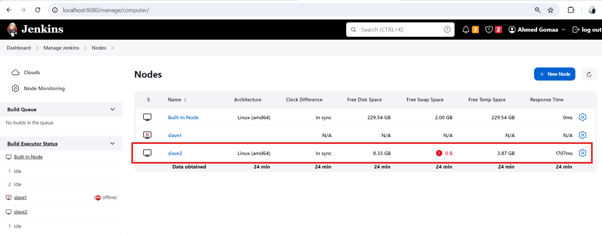

```groovy
// jenkinsfile for this project is like this 
@Library('shared-library') _

pipeline {
    environment {
        imageName = 'algn48/spring-boot-app'
        yamlfiles = 'kubernetes/Deploument.yml'
         }
    agent { label 'slave2' }
    stages {
         stage('Verify Branch') {
            steps {
                echo "$GIT_BRANCH"
            }
        }
                stage('List Tasks') {
                            steps {
                                sh '''
                                    cd Application
                                    chmod +x ./gradlew
                                    ./gradlew tasks
                                    '''} }
                        
                stage('build') {
                            steps {script{
                                sh '''
                                    cd Application
                                    chmod +x ./gradlew
                                      ./gradlew build '''                              
                            } }
                        }

                stage('test') {
                    steps {
                    script{
                        sh '''
                            cd Application
                            chmod +x ./gradlew
                            ./gradlew test 
                        '''                        
                    }}
                }

        stage('SonarQube Analysis') {
            steps {
               withSonarQubeEnv(credentialsId: 'jenkins-sonar',installationName: 'sq1') {
                    sh '''
                                    cd Application
                                    chmod +x ./gradlew
                                    ./gradlew sonarqube --info
                        '''
                    }
            }       }
  
        stage('Build and Push Docker Image') {
            steps {
                sh "echo done "
            buildPushtoHub([
            image: "${imageName}:${BUILD_NUMBER}",
            DockerCredentials: 'DOCKERHUB',
            dockerfile: 'Application/Dockerfile', // Optional: Specify the path to the Dockerfile
            context: 'Application' // Optional: Specify the build context directory
                 ]) 
                  }   }

        stage('Check and Install OpenShift CLI') {
    steps {
        script {
            
                sh "chmod +x scripts/install-oc.sh"
                sh "./scripts/install-oc.sh"
                sh 'oc version'            
        }   }
}

                stage('Deploy in cluster') {
        steps {
            sh "ls"
             sh 'sed -i "s|image:.*|image: ${imageName}:${BUILD_NUMBER}|" ${yamlfiles} '
             sh "kubectl apply -f ${yamlfiles} "
             sh "kubectl get all"
                }           
}
    }
}

```

 
### Explanation of Each Step
- Step 1: Verify Branch
This step outputs the branch name of the current Git repository to the console.

- Step 2: List Tasks
This step lists all available Gradle tasks for the project.

- Step 3: Build
This step builds the application using Gradle.

- Step 4: Test
This step runs the tests for the application using Gradle.

- Step 5: SonarQube Analysis
This step performs code analysis using SonarQube to ensure code quality.

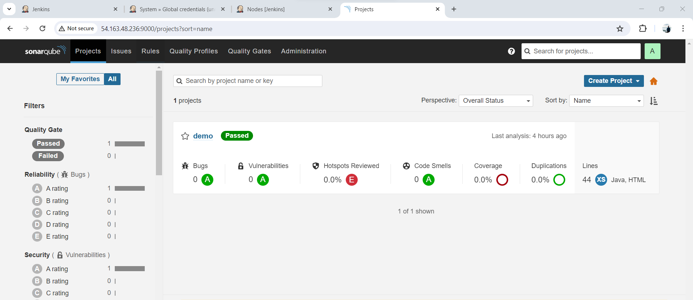

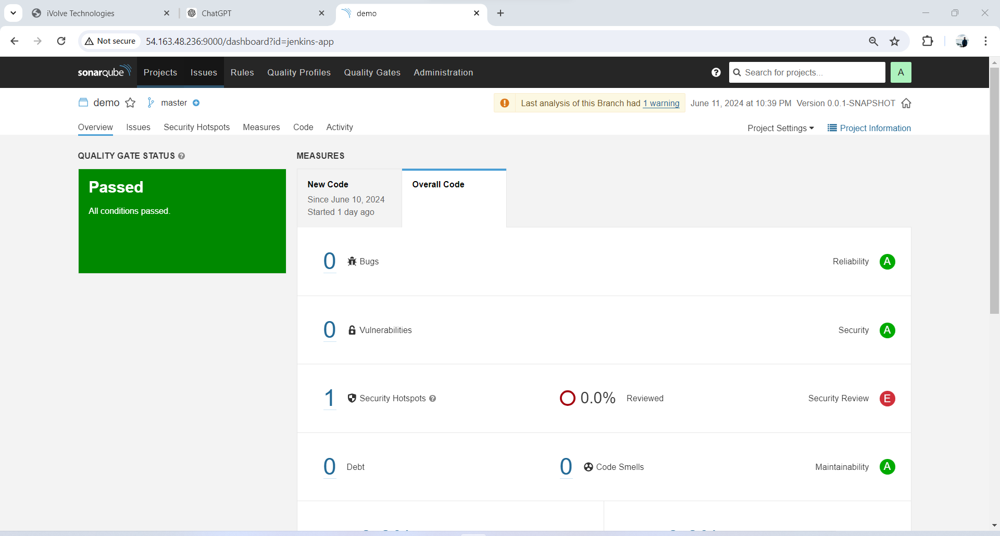
- Step 6: Build and Push Docker Image
    - This step builds the Docker image for the application and pushes it to Docker Hub using custom shared library steps.
    - tages is number of build jenkinsfile 

    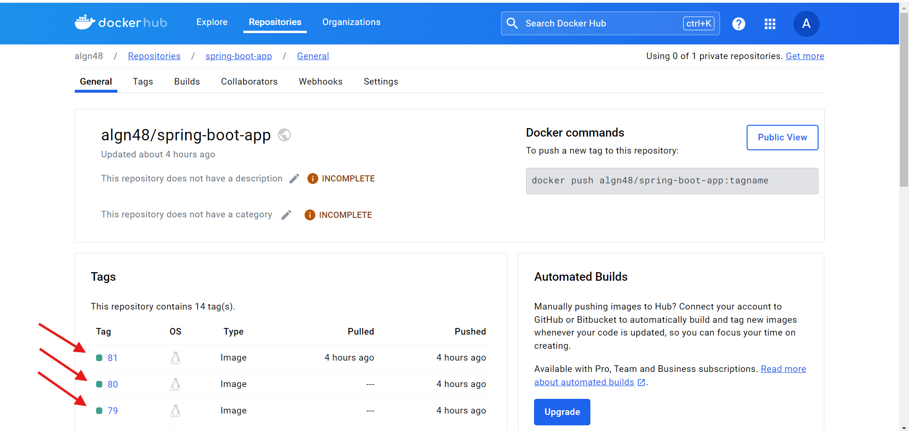
    in this stage we using Shared library for 
    #### Jenkins Shared Libraries
To manage reusable pipeline code, you can use Jenkins shared libraries. Create the following Groovy scripts in your shared library repository:

#### Shared Library Repository
You can find a custom shared library at the following URL:
[Shared Library](https://github.com/gAhmedg/Shared-library)

### Example Groovy Script: `buildAndPush.groovy`
Add this script to handle Docker image build and push operations.

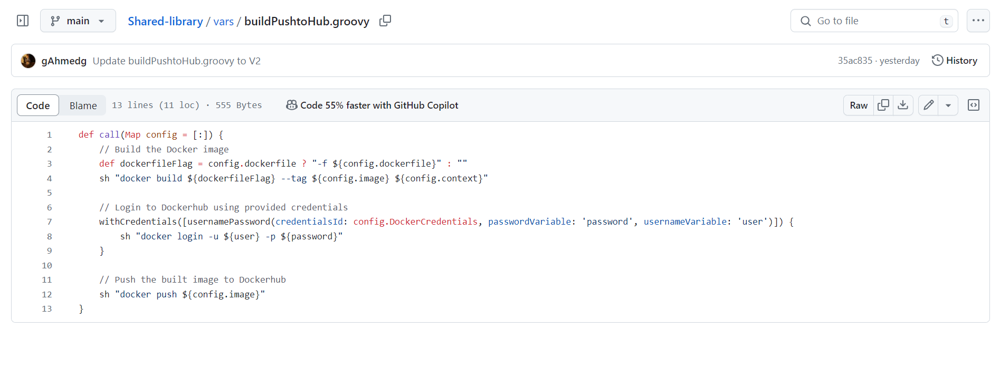

- Step 7: Check and Install OpenShift CLI
This step ensures that the OpenShift CLI (oc) is installed and available.

- Step 8: Deploy in Cluster
This step updates the Kubernetes deployment configuration with the new Docker image and applies the updated configuration to the Kubernetes cluster, then verifies the deployment.

By following these steps, you can set up a Jenkins pipeline that automates the process of building, testing, and deploying your application using Docker and Kubernetes.


### Initial Failures Before Success 
Despite facing multiple setbacks and failures during the initial stages of the pipeline, our persistence and continuous improvement led us to success.
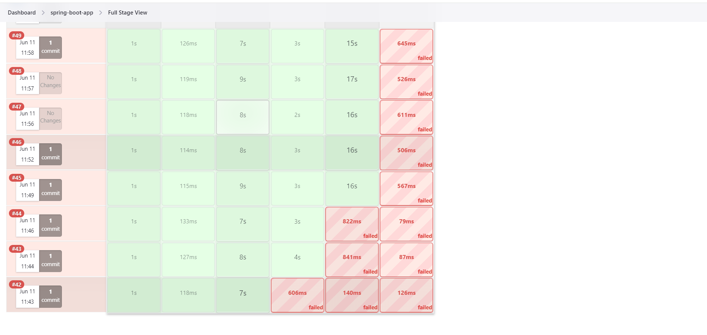

---
### Finally, the Pipeline Succeeded
After several iterations and troubleshooting, we achieved a successful pipeline execution. This was a significant milestone in our project.


---
## Verify the Deployment in the Cluster (minikube)

We then proceeded to verify the deployment within the cluster, ensuring all components were correctly implemented and functioning as expected
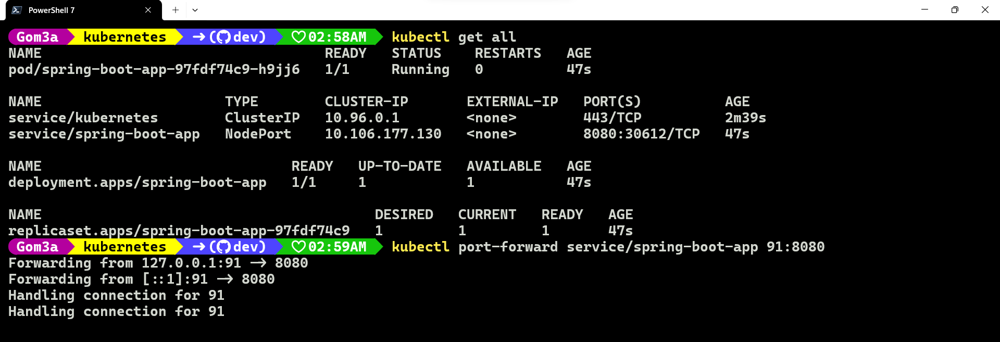

---

#### The final deployment was successfully validated, and the application was live and operational, ready to serve users.


## the last step to Deploy in OPENSHIFT cluster

### update jenkins file 
in this stage we using 
- oc new-app command to create deployment and service from image 
- create route for this service
- show the route to can access website 


```groovy
// the only change is in last stage to deploy in openshift cluster instead of  local cluster
                stage('Deploy to OpenShift') {
        steps {script {
                withCredentials([string(credentialsId: 'OPEN_SHIFT_TOKEN_LOGIN', variable: 'OPEN_SHIFT_TOKEN')]) {
                    sh " oc login --token=\${OPEN_SHIFT_TOKEN} --server=${ClusterUrl} --insecure-skip-tls-verify "
                    sh "oc new-app \${REGISTRY}/${imageName}:${BUILD_NUMBER}"  
                    sh "oc expose service/${SERVICE_NAME} "
                    sh "oc get route"

                      }
                }
                }
}
```


### Steps to get token of your username and password in openshift cluster
- login in GUI 


- choose copy login command

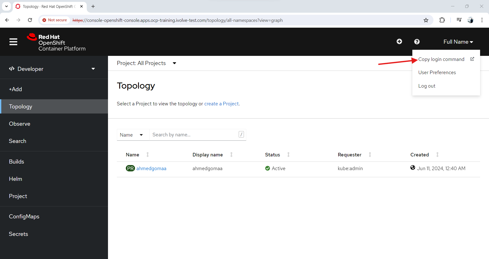

- Display the token, and the token in the command will be shown as in the photo below.

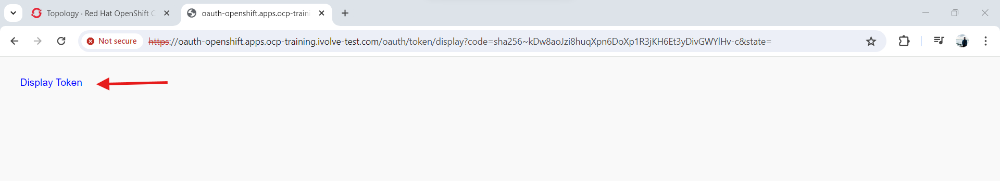

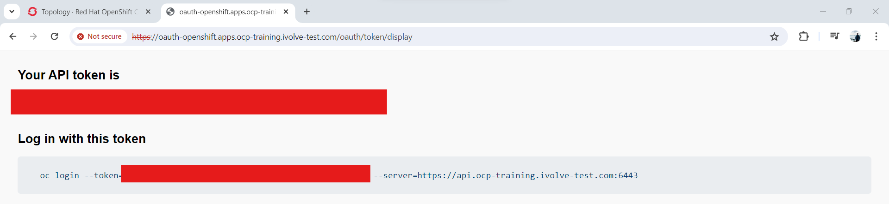 


### Run the jenkinsfile again and verify the Rote for your application 


### we can verify the application with

```bash
# to know the which cluster and user i used
 oc config current-context
```
 

 ```bash
# show 
 oc get all
 oc get route 
```
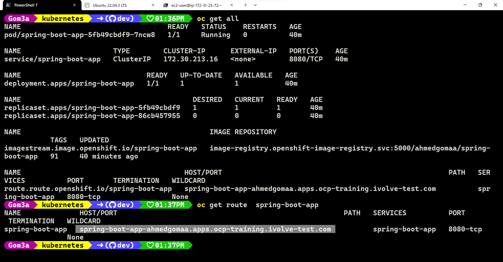

#### the Route of the Application
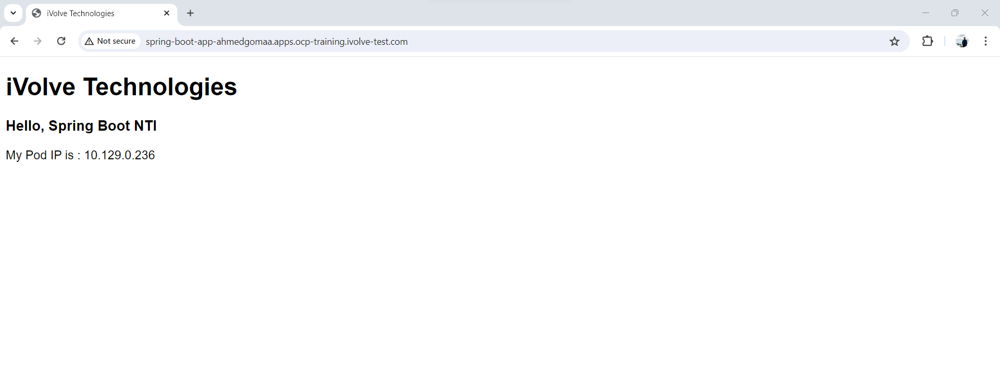

## the Next step to merage to main branch


### Updating Your Local Repository
After a pull request has been merged from the dev branch to the main branch using the GitHub GUI, you can update your local repository with the latest changes from the main branch by following these steps:


1. Navigate to your local repository:
Open your terminal or command prompt and navigate to your local repository using the cd command. For example:

```sh
cd MultiCloudDevOpsProject
```
2. Fetch the latest changes from the remote repository:
This command updates your local copy of the remote branches, but it doesn't merge any changes into your local branches yet.

```sh
git fetch origin
```
3. Switch to your local main branch:
Ensure you are on the main branch where you want to pull the updates.

```sh
git checkout main
```


4. Pull the latest changes into your local main branch:
This command merges the changes from the remote main branch into your local main branch.

```sh
git pull origin main
```
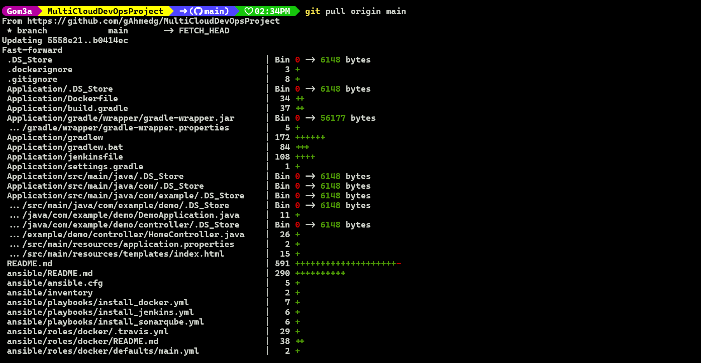

#### Verify the files in main branch 

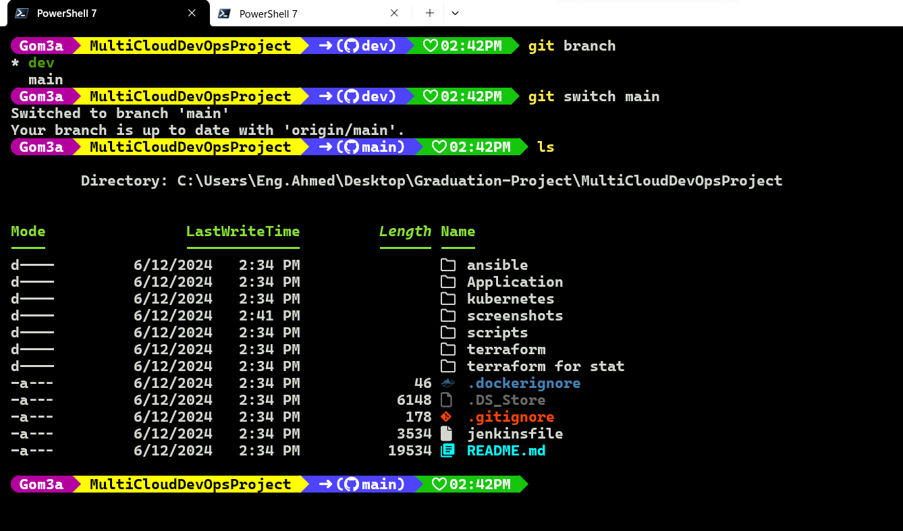

#### Here is the complete sequence of commands:

```sh
cd /path/to/your/repository
git fetch origin
git checkout main
git pull origin main
```
After running these commands, your local main branch will be up-to-date with the latest changes from the remote main branch.