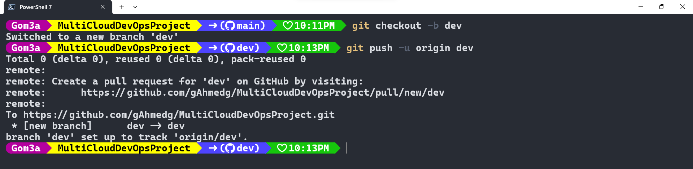
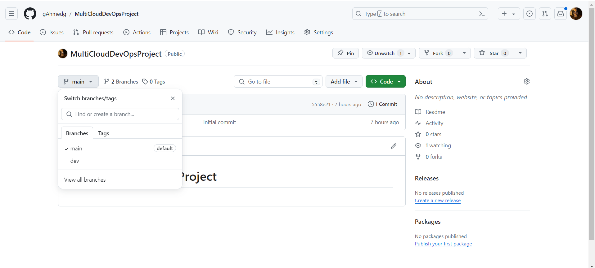

# MultiCloudDevOpsProject
**Welcome to the MultiCloudDevOpsProject repository! This project is designed to demonstrate a full DevOps pipeline including infrastructure provisioning, configuration management, containerization, continuous integration, monitoring, and logging, primarily focused on a multi-cloud environment.**

## Overview
The MultiCloudDevOpsProject aims to establish a robust DevOps pipeline using modern tools and practices across multiple cloud environments. This project involves infrastructure provisioning with Terraform, configuration management with Ansible, containerization with Docker, continuous integration with Jenkins, and extensive monitoring and logging.


## Table of Contents
- Project Setup
- Infrastructure Provisioning
- Configuration Management
- Containerization
- Continuous Integration
- Automated Deployment Pipeline
- Monitoring and Logging
- AWS Integration
- Documentation
- Contributing
- License

## Repository Setup
### Initial Configuration
- Create and Clone the Repository:

A new repository named "MultiCloudDevOpsProject" was created.
Clone this repository to get started:
```bash
git clone https://github.com/gahmedg/MultiCloudDevOpsProject.git
```
- Branching:
    - Main branch: Contains the production-ready code.
    - Dev branch: All development work happens here. Default branch for ongoing changes.

#### Branch Creation:

Create a development branch named dev.
Instructions:
```bash
git checkout -b dev
git push origin dev
```



#### And this the output in github website 




================================================================================================================================================================================================================================================================================================================================================================================================================================================================================================================================


Terraform Setup
Task: Provision AWS resources including VPC, subnets, security groups, and EC2 instances.
Steps:
Write Terraform modules for each resource.
Use the modules to create the infrastructure.
Commit the Terraform scripts to the dev branch.
Documentation:
bash
Copy code
git add .
git commit -m "Add Terraform scripts for infrastructure"
git push origin dev
Configuration Management
Ansible Configuration
Task: Use Ansible to configure EC2 instances.
Steps:
Create Ansible roles for installing required packages (Git, Docker, Java, Jenkins, SonarQube).
Define playbooks using these roles.
Commit the Ansible configurations.
Documentation:
bash
Copy code
git add .
git commit -m "Add Ansible configurations"
git push origin dev
Containerization
Docker Setup
Task: Create a Dockerfile to build the application image.
Steps:
Write the Dockerfile.
Commit the Dockerfile to the repository.
Documentation:
bash
Copy code
git add Dockerfile
git commit -m "Add Dockerfile"
git push origin dev
Continuous Integration
Jenkins Configuration
Task: Configure Jenkins for automatic Docker image building.
Steps:
Write instructions for Jenkins job configuration.
Commit these instructions.
Documentation:
bash
Copy code
git add JenkinsConfig.md
git commit -m "Add Jenkins configuration"
git push origin dev
Automated Deployment Pipeline
Jenkins Pipeline
Task: Create a Jenkinsfile for the deployment pipeline.
Steps:
Write the Jenkinsfile with stages for checkout, build, test, and deploy.
Commit the Jenkinsfile.
Documentation:
bash
Copy code
git add Jenkinsfile
git commit -m "Add Jenkins pipeline"
git push origin dev
Monitoring and Logging
Setup Instructions
Task: Configure centralized logging for applications running on OpenShift.
Steps:
Document the logging setup instructions.
Commit these instructions.
Documentation:
bash
Copy code
git add Logging.md
git commit -m "Add logging instructions"
git push origin dev
AWS Integration
Cloud Integration
Task: Integrate AWS services using Terraform.
Steps:
Write integration instructions using S3 for Terraform backend state and CloudWatch for monitoring.
Commit these instructions.
Documentation:
bash
Copy code
git add AWSSetup.md
git commit -m "Add AWS integration instructions"
git push origin dev
Documentation
Task: Provide detailed setup instructions, architecture overview, and troubleshooting guidelines.
Steps:
Compile comprehensive documentation.
Commit all documentation to the repository.
Documentation:
bash
Copy code
git add docs/
git commit -m "Add project documentation"
git push origin dev
Contributing
Contributions are welcome! Please read the CONTRIBUTING.md file for details on our code of conduct, and the process for submitting pull requests to us.

License
This project is licensed under the MIT License - see the LICENSE.md file for details.

This README provides a detailed guide through each phase of the project setup, ensuring clarity and providing commands that contributors can directly use to perform tasks related to the project. Remember to replace placeholders with actual values suitable for your specific project details.


